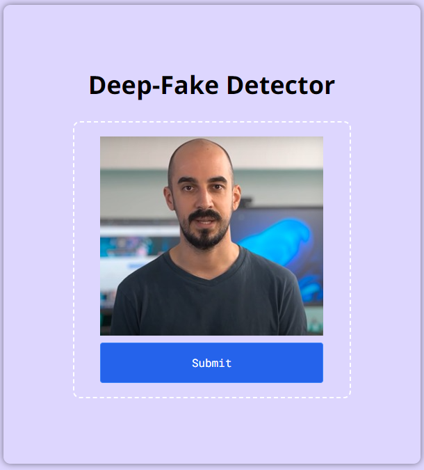
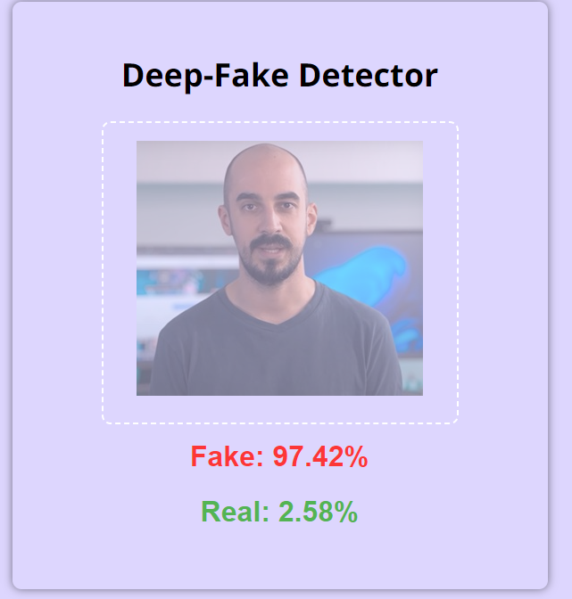
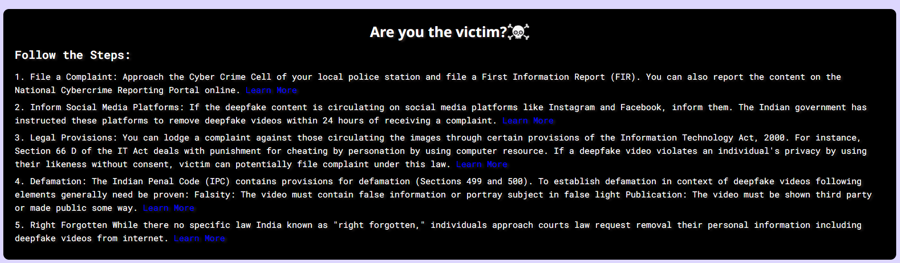

# Authentiscan: Combating Deepfakes with Open-Source AI

Authentiscan is a free, user-friendly platform that leverages open-source deepfake detection models to empower users in identifying manipulated media and combating the spread of deepfakes.

## Problem Statement:

With the rise of deepfakes, synthetic media created using AI to manipulate or fabricate audio, video, and images, there is an urgent need for ***reliable tools*** to verify the authenticity of digital content. Deepfakes can be exploited for malicious purposes, such as spreading disinformation, damaging reputations, facilitating scams, and enabling exploitation. However, there is a lack of widely accessible platforms that allow users to check whether media is authentic or manipulated.

**Domain:** Cybersecurity, AI Ethics, Digital Media

## Proposed Solution:

Authentiscan addresses the problem of deepfake detection by providing a **user-friendly platform** that utilizes open-source deepfake detection models. Users can easily upload media files (videos or images) for analysis, and within few seconds, Authentiscan will analyze the content and provide real-time results, confirming its authenticity or detecting any manipulation. The platform features a simple and intuitive interface, making it accessible to users of all technical proficiencies.

## Tech Stacks:

- **Front-end:** HTML, CSS, Tailwind-CSS
- **Back-end:** Python, Node.js
- **Deepfake Detection Models:** [Resnetinception-V1](https://huggingface.co/aaronespasa/deepfake-detection-resnetinceptionv1/tree/main)

- **Deployment:** AIML

## Tracks:

- Cybersecurity
- AI for Good
- Open-Source Innovation

## Installation Guide:

1. Clone the repository: `git clone https://github.com/IamPiklu/AuthentiScan.git`
2. Install the required dependencies for python: `pip install -r requirements.txt`
3. Install the required dependencies for node.js: `npm install`
4. Start the development server: `node server.js` or `nodemon server.js`
5. Open the application in your web browser: `http://localhost:3000`

## Usage:

1. Upload image or video .
2. Within seconds, Authentiscan will analyze the uploaded media and provide real-time results, confirming its authenticity or detecting any manipulation.

## Sample Input:

## Sample Output:

## Information about Complain:

## Contributing:

We welcome contributions to Authentiscan! If you'd like to contribute, please follow these guidelines:

1. Fork the repository
2. Create a new branch: `git checkout -b my-new-feature`
3. Make your changes and commit them: `git commit -am 'Add some feature'`
4. Push to the branch: `git push origin my-new-feature`
5. Submit a pull request

Please ensure your code follows the [coding style guide] and includes appropriate tests.

## License

Authentiscan is released under the [MIT License](LICENSE).
